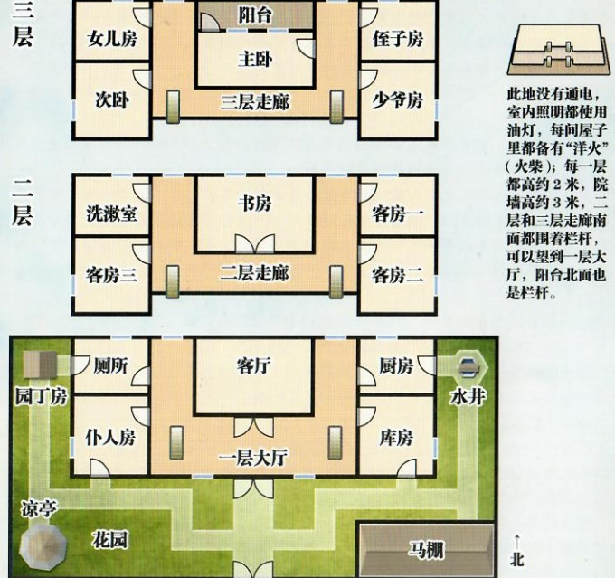
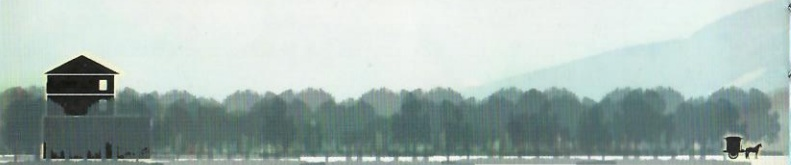
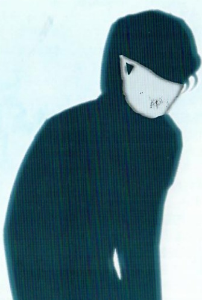

## 1 

## 智乐源 豪门惊情系列剧本

此地没有通电，室内照明都使用油灯，每间屋子里都备有“洋火”（火柴）；每一层都高约2米，院墙高约3米，二层和三层走廊南面都围着栏杆，可以望到一层大厅，阳台北面也是栏杆。

豪门惊情系列剧本《待月 栽 栽》

游戏设计 & 原创故事：刘斯宇 / 美术 & 原画：文博 / 美工：风舞渊 兔淘淘

版权所有 北京智乐源文化发展有限公司 2020

zhileyuanbg.cn

男。不到四十岁。垂着一头黑发，有些驼背，带着口罩，面色泛蓝，曾在衙门任职。

# 待月 栽 栽

“岑家主人”岑仲古

我怕家里有人会害我，才请诸位来帮忙。

