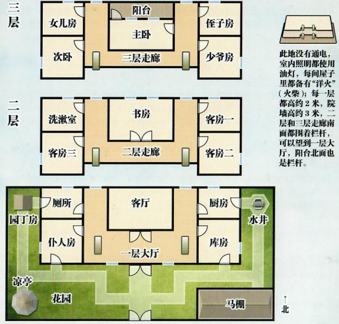

## 2 

## 智乐源 豪门惊情系列剧本

豪门惊情系列剧本《待月弑杀》

游戏设计 & 原创故事：刘斯宇 / 美术 & 原画：文博 / 美工：风舞渊 兔淘淘

版权所有 北京智乐源文化发展有限公司 2020 zhileyuanbg.cn

男。四十岁上下。戴着『紫色面具』，身穿西装，是上海『雾』夜总会的经理。

# 待 月 栽 殺

## “男性访客”田吉雾朗

岑仲古君的“请柬”里提到的“灾厄”是什么？