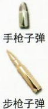

男人扔了名片，改口说自己是中国人，你就倒出一颗滋补药丸塞进他嘴里，看他没有咽，就把枪口对准他，吓得中年男人马上把药丸吞了下去。你没忍住笑，又吓唬他说这药丸名叫“山魈散”……你还没说完，中年男人就接口道：“山魈断魂散，死者面如蓝，银针测不出，入骨命难还！”你看男人听说过“山魈散”，就更加高兴，说省得自己费口舌解释了——你威胁中年男人说他要是想活命，明天就去“无锡站”以东的树林里，会有一个女人去找他，他只要按她的吩咐做事，三天后就会得到解药！你说完就解开了绳子，策马而去，留下中年男人在原地不住发抖。

你骑马来到无锡，去“有财客栈”，存下白马，问了附近哪里有卖洋装的地方，然后去客栈附近的酒馆吃饭，旁边一桌有人在聊“岑家”的事——你听说那里的老爷被“山魈”附身了，佣人们在前几天都逃走了，就剩下一个管家——似乎还出了人命大事！你歪头看了一眼，见到一个衣着整齐的男人。

今天（8月11日），你早起后离开客栈（你把白马和行李都存在客栈，没有退房，此前预付的20银元的房租押金里包括马的饲料费，还没有花完），去买了长裙和一个“金色面具”（请柬上只有一个人的名字，你只能扮成田吉雾朗的同伴，又因为“岑家”的管家已经见过你两次，你怕他不放你进去，就想到扮成戴面具的月蝶），之后你还想买一个“紫色面具”，却没找到这种少见颜色的面具，只好买了“红色面具”和靛蓝染料，涂成“紫色”。你之后又买了“长假发”（你的短发特征太明显）和一个长琴匣，把包着“汉阳步枪”的“青布”长包裹和此前买到的“刺刀”都收在里面。

午后，你带着女士包和长琴匣，戴上“金色面具”和“长假发”，换装后来到约定的树林里，见到等候的中年男人。你自称【月蝶】，给对方“紫色面具”，让他戴上装扮成“田吉雾朗”，陪你去一个地方，事成之后，就会给他解药——如果他搞砸了，就等着毒发身亡吧！

之后你让“田吉雾朗”（中年男人）帮你拿着长琴匣，带他来到“岑家”，给你们开门的人仍是管家。你把“请柬”递给管家，说自己是陪同【田吉雾朗】来的。管家神情有些慌张，没看“请柬”就带你们去了“客厅”，然后离开——此时虽是白天，但“客厅”没有窗户，靠油灯照明。

“田吉雾朗”低声对你说他并不了解【田吉雾朗】，你就告诉他你知道的全部有关【田吉雾朗】的事情……你还没说完，管家就带着一位教授打扮的男人来到“客厅”，你随手把“请柬”递给了“田吉雾朗”。

教授打扮的男人看到你们后主动寒暄，自我介绍是上海“圣约翰大学”的【卓尔瑞】（正是你昨天看到的那个衣着整齐的男人）……“田吉雾朗”模仿着日本人的腔调，也做了自我介绍。

不久，管家又带着两位年轻女性走进“客厅”，其中一个身穿崭新的洋裙的女性是你在“雾”夜总会“VIP房”的窗口里见到过的……之后管家走去三层，带着家主人【岑仲古】走下来——虽然隔着口罩，你还是看到【岑仲古】泛蓝的皮肤，以及他腰上的“手枪”——你想到听说过的“山魈散”，不禁打了个寒颤……

## 8 月11日14:00（“客厅”内）寒暄

## 你在此阶段必须做出以下“表现”，还可以询问想知道的事

1、你是混进“岑家”的，因此不能被人发现自己的真实身份（你要等之后能单独见面的时候再去找岑仲古问你母亲的事）。

2、你需要中年男人继续为你装扮“田吉雾朗”，因此不能让他发觉你给他吃的“山魈散”只不过是补药，也不能让别人发觉你带着枪械（你的“汉阳步枪”属于军火，被人发现就可能惹上麻烦事）。

3、你在小报上看到对【月蝶】的描述都是身世神秘，因此可以随便编一些来历等事（例如为什么要一直戴着“金色面具”）。

4、你（月蝶）即将拍一部电影，做女主角（这其实是你在小报上看到的，有人问具体内容时，你可以说要保密）。

5、你（月蝶）目前没有男朋友，但是有追求者，其中包括一些富家公子（你猜一个女歌星肯定会有这类追求者）。

6、你要编一个跟着“田吉雾朗”来“岑家”的理由，帮助中年男人顺利伪装。

## 你的目的（一）

## 此阶段的“目的”，在后面的阶段继续完成

1、隐瞒你不是真正的【月蝶】。（2分）

2、找到母亲【唐婉枫】“死亡”的真相。（2分）

3、隐瞒你给中年男人吃的“山魈散”是假的。（2分）

## 你的技能【枪械】

（你能辨认出以下枪械的型号和子弹口径）

勃朗宁 M1903

产地：美国

容弹量：8发

直径9mm的手枪子弹

柯尔特公司

设计

汉阳步枪

产地：中国汉阳

容弹量：5发

直径8mm的

步枪子弹

汉阳兵工厂

设计

步枪子弹

## 名词解释

山魈：一种猴科灵长类动物，长有鬼魅似的面孔，脸长，鲜红的鼻梁，脸颊蓝色，与中国神话传说中的独脚鬼怪同名——在日本的民间传说中，也有名叫山魈的妖怪。

刺刀：是装于单兵长管枪械（如步枪、冲锋枪）前端的刺杀冷兵器，用于白刃格斗。

Hermès：1837年由Thierry Hermès创立于法国巴黎，以制造高级马具而闻名的品牌。

梅花糕：江南的风味特色小吃，由白面粉，豆沙，糖猪板油丁制成，甜而不腻、软脆适中

## （先不要翻开下一页）

【岑仲古】让管家送大家去客房后，结束寒暄，翻开下一页（07页）开始阅读