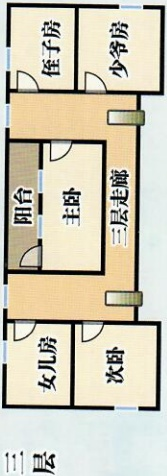
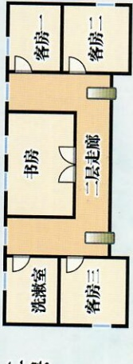
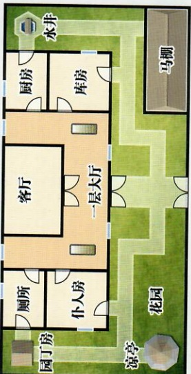

# 待民獄殺

## 游戏说明 & 真相揭秘

## 智乐源 豪门惊情系列剧本

请在游戏开始前阅读本说明，并按照流程进行游戏，“岑家”的地图在剧本背面为保证游戏乐趣，“真相揭秘”（03页）在游戏结束后才能观看

游戏分为两幕（三个阶段）

第1幕后，不调查，不可私聊（建议在此阶段多了解自己需要的信息）。

第2幕后，调查“随身物品”、“岑家”，直到拿完线索，可以私聊。

（地点是“客厅”内，不调查）

首先，玩家们尽量挑选适合自己的角色；之后开始阅读自己剧本——从“背景故事”开始阅读（01页-06页，看到“先不要翻开下一页”时就不要再看），这样就能了解为什么你会出现在这里，并且知道你在“交流阶段”要注意表现什么样的“演技”，并尝试完成你的一部分目的（现在没有完成的“你的目的”可以在下个阶段继续完成）。注意：玩家在游戏里要通过自我介绍和发问来了解彼此。

然后玩家们扮演自己的角色开始游戏，可以互相聊天、询问，保持礼貌或作出相应的反应和表演——可以在这时尝试达成“你的目的”（本阶段是集体寒暄，没有私聊），并完成自己需要表现出来的内容。

## 第2幕“谁是真凶” 调查之后可以私下交流

玩家先阅读自己剧本有关这部分的内容（07页-8页，看到“先不要翻开下一页”时就不要再看）。此阶段玩家可以继续调查，直到拿完所有的线索卡（线索卡的背面标出可调查的具体内容，谁都没有可以拿的线索时，就结束调查）。

## 调查方法

# 调查时按“剧本编号”依次进行调查（满足条件后可以调查“秘密线索”）——每人只能隐藏最多1张线索卡（也可以不隐藏），拿到第2张后，必须决定公开1张或全部公开（没有可以拿的线索卡就跳过）。一轮搜完后可以交流，之后再继续调查——无论“岑家”，随身物品，还是“秘密线索”，只能最多隐瞒1张——线索一旦被人拿取，其他人就不能再去拿了。

# 不能调查自己住的房间或随身物品，没有自己可以拿的线索就跳过。

## “秘密线索”

# 有的线索卡上会标明可以去调查“秘密线索 XX”，如果玩家持有此线索，在下一轮调查时，就可以按号码，拿取对应的一个“秘密线索”——“秘密线索”的号码写在线索卡背面。

豪门惊情系列剧本《待月弑杀》

游戏设计 & 原创故事：刘斯宇 / 美术 & 原画：文博 / 美工：风舞渊 兔淘淘

版权所有 北京智乐源文化发展有限公司 2020

如果此线索已经公开，那任何人都可以去拿对应的“秘密线索”。

### zhileyuanbg.cn