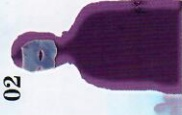
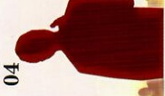
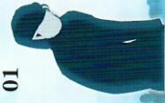
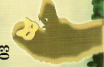
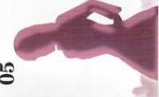
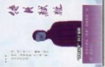
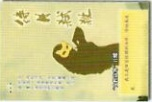
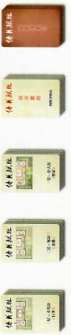
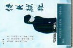
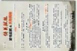

## （先不要翻开下一页） 【警告】后面是事件的“全部真相”，请不要在游戏结束前打开观看

在几个小时以后，玩家们都充分了解了情况之后，大家也都没有要继续询问或者调查的内容之后，可以宣布游戏结束。

这时玩家们要填写“你知道吗？”，包括指认凶手，完成任务，揭露秘密等。然后公开所有的内容。

## 你知道吗？

## “访客”田吉雾朗

男。四十岁上下。戴着“紫色面具”，身穿西装，是上海“雾”夜总会的经理。

女，十九岁。聪明伶俐，个子不高，身穿蓝花衣裤，在上海“茱丽”孤儿院工作。

## 扮演角色

## “访客”卓尔瑞

男。三十二岁。身穿浅色正装，佩戴怀表，举止斯文，是上海“圣约翰大学”的教授。

（注：民国前出生的角色的年龄皆是“虚岁”，以“出生年”为1岁）

在游戏结束之后，玩家们按自己的游戏效果（是否完成目标或者其他），阅读自己扮演角色的一个特定结局（每个角色都有不同结局，目的完成得越多，结局往往就会

## 06

## “岑家主人”岑仲占

男。不到四十岁。垂着一头黑发，有些驼背，带着口罩，面色泛蓝，曾在衙门任职。

注：有的目的会触发额外结局，可以把所有满足条件的结局都叠加，作为完整结局，例如同时满足“结局一”和“结局三”，就可以组合起来作为一个结局。

## “访客”月蝶

女。年纪不详。长发，戴着“金色面具”，身穿艳色长裙，是上海“雾”夜总会的红歌星。

女。二十一岁。美貌清秀，扎着辫子，身穿崭新的洋裙，在上海“茱丽”孤儿院工作。

## “访客”平佳妹

我们的故事发生在距今一百多年前的1914年（民国三年）8月11日。这场推理游戏包括一共两幕，时间大约在4个小时，请准备好水或一些饮料，可

——北京智乐源2020.01.05

开始游戏后，请大家认真扮演好自己的角色，找出案件的真相，以及真相背后的故事——除了可能发现的线索，情报还隐藏在玩家们的行为或语言之中。

最后，祝大家享受游戏乐趣。

## 声明

## 游戏内容

①、六名角色的剧本——剧本背面有“地图”。

②、游戏说明 & 真相——在游戏结束后才能阅读“真相”

③、线索卡——“岑家”+“秘密线索”

当您看到这行字时，就代表您已经准备好开始参加一次“豪门惊情系列剧本”的

《待月弑杀》是一个供18岁以上人士进行的角色扮演游戏含有如谋杀、阴谋等内容，如果您对此持反对态度，请不要参与

游戏的玩家人数共计六人，都是剧本角色，不包括警察或侦探类的角色，也不包括主持人。警察或侦探还有主持人也可以根据实际情况自行添加。

## 罗伯特·路易斯·史蒂文森

《待月弑杀》原创人物、故事，作者拥有全部版权未经许可不能进行改编、出版、复制销售、公开传播等行为

更不要模仿或试图模仿游戏里的内容

## 我们不承担由此引起的任何后果及责任

违者将视情况追究法律责任

本游戏为虚构故事，请勿与现实中的人物、团体和事件相联系

恶贯满盈的人之所以面对诱惑仍能稍微稳定地行走，靠的正是这些本能。

