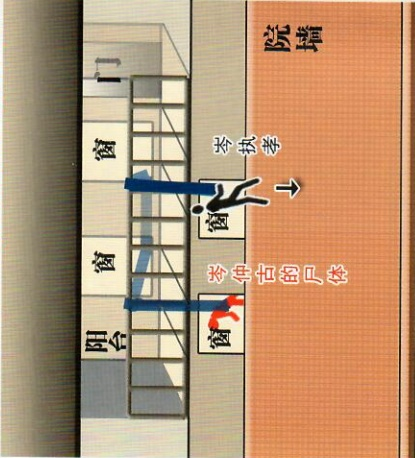

之后【云凌】到访，再次被赶走（岑执孝让管家想办法赶走她，管家就看了“请柬”后，随便用了一个她不是“请柬”上的日本男人的理由）（秘密线索09、11）。下午，【云凌】坐火车（6154次）去了苏州（客房二女士包里的火车票），【岑执孝】卸妆后坐火车（6155次）回到上海，买了11日去无锡的头等火车票。【依秀】去

9、没被烧完的日记是【岑仲古】亲笔所写（主卧的日记），字迹和“请柬”上的不一样，他因为抓错人而愧疚，已经决定不再联系“卓尔瑞博士”了。

10、在【岑仲古】离开上海时，孤儿院并没有改名（孤儿院只改名了2年，少爷房的报纸），而给【平佳妹】的“请柬”封面上写的是“荣丽孤儿院”，在【岑仲古】的本人仍写着浦东孤儿院（书房记账本）。

8月10日，大学开学。清晨，【岑执孝】驾车给【平佳妹】送去火车票，之后赶往无锡。【阿俊】接到【雪寒】的命令，前往无锡送信（客房二皮箱包里的信），“卓尔瑞”（艾德）和他坐同一辆火车（6155次），却不同车厢（两人客房内的火车票是头等和三等）。【阿俊】在苏州遇到【云凌】，被强迫吃下假的“山魈散”，为了解毒活命，赶到无锡。【云凌】骑马提前来到无锡，遇到正在打听“岑家”情况的“卓尔瑞”（艾德），都在无锡住宿（客栈的押金收据上有日期）。

下午，【岑执孝】驾车回到无锡，寄存下马车后，跑回“岑家”，扮成“岑仲古”，把煤油拿进“书房”（秘密线索07），浇到【岑仲古】的尸体上，并用空油桶再次打昏【岑扬礼】（书房窗边的空桶）

8月11日，【云凌】扮成“月蝶”，跟着扮成“田吉雾朗”的【阿俊】进入“岑家”，之后“卓尔瑞”（艾德）也来到“岑家”。【依秀】和【平佳妹】坐同一辆火车（3808次）来到无锡，却不同车厢（两人身上的火车票是头等和三等），来到“岑家”。扮成“岑仲古”的【岑执孝】正在等着“客人们”。

10日上海→南京：8点6154，10点6155；南京→上海：8点3808，10点3809。

11日上海→南京：8点3808，10点3809；南京→上海：8点6154，10点6155。

【岑扬礼】之死与被烧尸的【岑仲古】之后杀害【岑扬礼】的真凶是也是【岑执孝】（具体过程详见“岑仲古”剧本07

车票上，客房二里有一张短程的），可以算出上海→南京的票价（1.6/4）约占4/10，行程时间大约4小时，如果上午8点从上海发车，午后12点左右就可以到达无锡（从南京发车达到无锡约6小时）——真凶可以乘火车，在下午离开无锡。

14、结合秘密线索07和09，“短发女人”（云凌）在8月5日到访时，管家见到的“老爷”并没有戴口罩，之后管家送走【云凌】，没有锁门就去见太太，并安慰太太，然后听到“碰”的声响，之后见到的“老爷”戴上了口罩——【田吉雾朗】只送给【岑仲古】一把装满子弹的“手枪”，枪里只少了一颗子弹（书房柜子里有枪支资料，弹壳掉在书桌下面），而【岑仲古】的真正死因正是中弹身亡（秘密线索01），死后被焚尸，因为已经腐烂，有臭味——焚尸是为了掩盖真正的死亡时间。

2、【岑仲古】的尸体被大面积焚烧，只有脸部能辨认，是真凶故意没有把煤油泼到上面。

3、【岑扬礼】尸体上有两张座位号相连的火车票，说明还有一个人和他一起坐火车（秘密

15、管家最后见到太太是看到她去了“主卧”，之后就再没人见到活的太太，此前【岑执孝】已经把“梅花糕”给“老爷”送进“主卧”，之后又是【岑执孝】把“老爷”吃完的母子送主“厨官”（秋宝作00）

16、【姜艳美】被【岑执孝】杀害时，身在阳台，掉了一只“银耳环”。17、【岑仲古】的尸体被吊上去时，“假发”掉在“书房”里。

4、【岑扬礼】尸体附近的血迹是故意用来遮挡此前命案的血迹，但仍有一点没有被挡住，就在书柜北面（书房的书柜，上面血迹是暗红色的）。

18、蓝色是可以染上去的（提示有毛巾和田吉雾朗的面具、靛蓝染料等），凶手用的是墨水（可以看到写的请柬和“杀人魔”的威胁信都是蓝色笔迹，书房书桌上有墨水）。19、凶手烧毁票据后，仍留下一小片儿没有烧完的“火车票”（厨房碎纸）。

20、【岑扬礼】是被骗回来的，真凶必须杀了他，才能继承“岑家”的遗产。21、“主卧”的窗帘都被泼上过煤油，才会几乎都烧干净。

22、【岑执孝】在外面点火后，火会沿着泼上煤油的窗帘一直烧进房里，点燃尸体。23、利用捆在阳台栏杆上的窗帘（栏杆上的漆掉了），习武的【岑执孝】（随身匕首是

是衙门捆犯人时惯用的“驷马倒攒蹄”，超过一天，手足已经严重淤血（秘密线索02）。7、【姜艳美】的尸体是死后才被【岑执孝】用随身的匕首割开喉咙，因此没有多少出血（秘密线索03）——《岑执孝》救火时还用这把匕首割断系着水桶的井绳。8、【岑执孝】扮成“岑仲古”时吃过了“梅花糕”，因此吃不下自己的（侄子房里的坏

24、【岑执孝】伪装“岑仲古”，让管家去找太太时，故意提醒去“外面”和“岑家”前“后”找（秘密线索02）

25、“侄子房”里的书上有子弹数据，可以判断“书房”里的弹壳的长度是手枪的（勃朗宁 M1903 手枪），也能证明【岑执孝】了解枪支。

26、“书房”里书柜北面有血迹，是【岑仲古】中枪死亡时沾上去的，开枪的位置在对面的书桌北侧（弹壳、被撬的锁）。