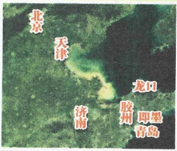
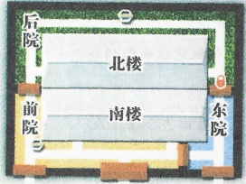
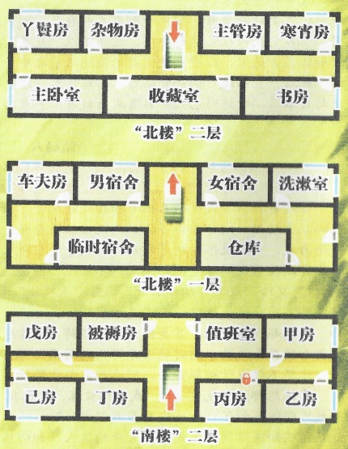
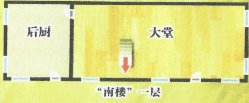

## 2 

## 智乐源 豪门惊情系列剧本

“复泉楼”

外墙高约3米，分为3个院子

南、北楼一层和二层都高约2米

内有电灯照明

游戏设计 & 原创故事：刘斯宇 / 美术 & 原画：云客 / 美工：灵兔 风舞渊

版权所有 北京智乐源文化发展有限公司 2021 zhileyuanbg.cn

女。二十岁。小圆脸，梳着长辫子，身穿宽袖衣裤，面带泪痕，声音哽咽。

“妹妹”寒霄

## 复 白 水 楼

为什么……为什么旗劳会死...