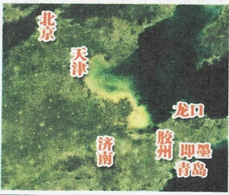
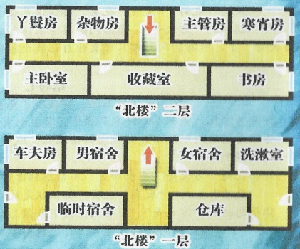
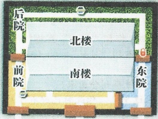
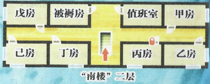
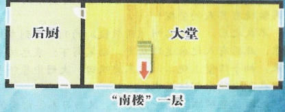

## 3 

## 智乐源 豪门惊情系列剧本

“复泉楼”

外墙高约3米，分为3个院子

南、北楼一层和二层都高约2米

内有电灯照明

豪门惊情系列剧本（复泉楼）

游戏设计 & 原创故事：刘斯宇 / 美术 & 原画：云客 / 美工：灵兔 风舞渊

版权所有 北京智乐源文化发展有限公司 2021

zhileyuanbg.cn

男。二十多岁，身穿一件青布长衫，有胡茬，自称是城中的警探，却拿不出证件。

## “警探”谷负

## 复白水楼

我身为警探，一定会调查出这位老人死亡的真相。