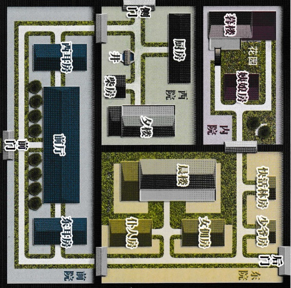

# 智乐源 豪门惊情系列剧本

←“正定”是县城，此时的“东兆通”、“西兆通”和“凌透”都是“石家庄”东面的村镇。

振头站宝庄■西兆通■东兆通

北

↓“宝庄”院墙高2.5米，分为四个院，其中的晨楼、夕楼和暮楼都高约5米（每层高2.5米），楼距离院墙约2米，暮楼二层只能从露台进出。

## 豪门惊情系列剧本《绝崖雕》

游戏设计 & 原创故事：刘斯宇 / 美术 & 原画：文博 / 美工：风舞渊 兔淘淘 版权所有 北京智乐源文化发展有限公司 2020

zhileyuanbg.cn

请在游戏开始前阅读本说明，并按照流程进行游戏，“宝庄”内外的地图在剧本背面为保证游戏乐趣，“真相揭秘”（03页）在游戏结束后才能观看

第二阶段（05-06页）：调查3轮（共18次），可调查地区：“庄外”。

第三阶段（07-08页）：调查所有剩下的地区，直到拿完线索，可以私聊。注：莲儿、禾儿、春娅不能调查内院；挑铁、快活林不能调查东院；石孙不能调查西院。

## 第1幕“寒暄”

## （地点是“前厅”内，不调查）

首先，玩家们尽量挑选适合自己的角色；之后开始阅读自己剧本——从“背景故事”开始阅读（01页-04页，看到“先不要翻开下一页”时就不要再看），这样就能了解为什么你会出现在这里，并且知道你在“交流阶段”要注意表现什么样的“演技”，并尝试完成的一部分目的（现在没有完成的“你的目的”可以在下个阶段继续完成）。注意：玩家在游戏里要通过自我介绍和发问来了解彼此。

然后玩家们扮演自己的角色开始游戏，可以互相聊天、询问，保持礼貌或作出相应的反应和表演——可以在这时尝试达成“你的目的”（本阶段是集体寒暄，没有私聊），并完成自己需要表现出来的内容。

## 第2幕“谁是真凶”

玩家先阅读自己剧本有关这部分的内容（05页-06页，看到“先不要翻开下一页”时就不要再看）。此阶段玩家可以进行调查，但不可以私下交流（线索卡的背面标出可调查的具体地点）。

# 调查时按“剧本编号”依次进行调查（满足条件后可以调查“秘密线索”）——每人只能隐藏最多1张线索卡（也可以不隐藏），拿到第2张后，必须决定公开1张或全部公开（没有可以拿的线索卡就跳过）。一轮搜完后可以交流，之后再继续调查——无论“宝庄”内外，还是“秘密线索”，只能最多隐瞒1张——线索一旦被人拿取，其他人就不能再去拿了。# 没有自己可以拿的线索就跳过。

## 调查方法

# 有的线索卡上会标明可以去调查“秘密线索 XX”，如果玩家持有此线索，在下一轮调查时，就可以按号码，拿取对应的一个“秘密线索”——“秘密线索”的号码写在线索卡背面。# 如果此线索已经公开，那任何人都可以去拿对应的“秘密线索”。

玩家先阅读自己剧本有关这部分的内容（07页-08页，看到“先不要翻开下一页”时就不要再看）。此阶段玩家可以继续调查，直到拿完所有的线索卡（谁都没有可以拿的线索时，就结束调查）。