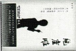
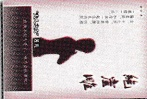
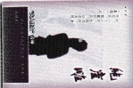
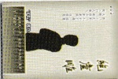

太行之路能摧车，若比人心是坦途。巫峡之水能覆舟，若比人心是安流……行路难，难重陈。人生莫作妇人身，百年苦乐由他人。

## 声明

## 《绝崖雕》原创人物、故事，作者拥有全部版权

尊敬的女士/先生：

当您看到这行字时，就代表您已经准备好开始参加一次“豪门惊情系列剧本”的角色扮演推理游戏。

我们的故事发生在距今一百多年前的1914年（民国三年）9月21日。这场推理游戏包括一共两幕，时间大约在4个小时，请准备好水或一些饮料，可以自由活动。

开始游戏后，请大家认真扮演好自己的角色，找出案件的真相，以及真相背后的故事——除了可能发现的线索，情报还隐藏在玩家们的行为或语言之中。

最后，祝大家享受游戏乐趣。

②、游戏说明 & 真相——在游戏结束后才能阅读“真相”。

③、线索卡——“庄外”+“前院”+“东院”+“西院”+“内院”+“秘密线索”。

游戏的玩家人数共计六人，都是剧本角色，不包括无剧本的侦探，也不包括主持人（可以根据实际情况自行添加无剧本的侦探或主持人）。

北京新闻中心

## 游戏开始前，先把线索卡背面向上，分类摆好

在几个小时以后，玩家们都充分了解了情况之后，大家也都没有要继续询问或者调查的内容之后，可以宣布游戏结束。

这时玩家们要填写“你知道吗？”，包括指认凶手，完成任务，揭露秘密等。然后公开所有的内容。

在游戏结束之后，玩家们按自己的游戏效果（是否完成目标或者其他），阅读自己扮演角色的一个特定结局（每个角色都有不同结局，目的完成得越多，结局往往就会越好）。

注：有的目的会触发额外结局，可以把所有满足条件的结局都叠加，作为完整结局，例如同时满足“结局一”和“结局三”，就可以组合起来作为一个结局。

## 角色结局

## 扮演角色

（注：民国前出生的角色的年龄皆是“虚岁”，以“出生年”为1岁）

## “夫人之女”莲儿

女。十七岁，窄肩细腰，性格偏柔弱，和母亲一起住在内院“暮楼”二层。

## “姨娘之女” 禾儿

03 “夫人侄女”春娅女。二十三岁，性格内向，身穿花衣，鬓戴白花，住在内院“暮楼”一层。

女。十六岁，性格倔强，

和母亲一起住在内院

“姨娘房”。

05 “戏曲艺人”快活林男。三十多岁，为人恭顺，一口京腔，住在东院“快活林房”。

## “护院”挑铁

男。十九岁，个子不高，浓眉大眼，有些少年老成，住在东院“仆人房”。

男。不到三十岁，身穿粗布旧衣，平时肩挎药箱，手持“虎撑”，住在西院“夕楼”一层。