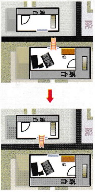

# 今天（9月21日）的案件

【莲儿】把毒药下到【快活林】让女佣送到“姨娘房”的“汤药”里，毒杀了姨娘（详见莲儿剧本05页），下面列出一些重点：

1、姨娘是中毒而死，碗里还有汤药的痕迹，这药是不久前才送来的（手帕处证词）。2、在今天（9月21日）早起“法蓝瓶”和梯子在一起（王大娘证词），之后在“暮楼”二层发现了“法蓝瓶”（桌上），今天只有“暮楼”二层的人能接触到毒药。3、死考划出的“+”是“薄”字的扣第（可以对照“草株”一层的下半个“吨木”）姨娘

3、死者划出的“+”是“运”字的起笔（可以对照“暮楼”一层的下半个戏本），姨娘

4、姨娘和夫人的矛盾导致【莲儿】想杀了姨娘。

5、原本“法蓝瓶”在“晨楼”二层（秘密线索02），是被人偷出来的，偷东西的人是女性，使用梯子进出（李大娘证词）——《莲儿》偷完东西后，利用梯子去东院与【发顺】私会（小赵证词），之后又利用梯子做到不经过前院离开西院，曾把“法蓝瓶”遗落在内院墙边的梯子旁（手帕处证词）。

## 夫人之死

【春娅】把毒药下到【快活林】让女佣送到“暮楼”二层的“汤药”里，毒杀了夫人（详见春娅剧本05页），下面列出一些重点：

1、夫人是中毒而死，碗里还有汤药的痕迹，这药是不久前才送来的（于帕处证词）。2、在今天（9月21日）早起“法蓝瓶”和梯子在一起（王大娘证词），之后在“暮楼”二层发现了“法蓝瓶”（桌上），今天只有“暮楼”二层的人能接触到毒药。

3、红枣、化生、桂圆、连子谐首“早生贵子”，死者手中的连子花生指问要成亲的人。4、夫人不可能同意【春娅】离开，她也想靠【春娅】嫁人来对付姨娘（王大娘证词）。5、【春娅】家里是开古玩店的，她爹也知道“钩吻”是毒药（秘密线索03）。

6、夫人觉得【春娅】和【快活林】有关系（夫人看到快活林在春娅住处安慰她，之前快活林又主动要求陪着春娅和她爹去京城），才会大怒要去告诉老爷，【春娅】却以为夫人说的是“石头哥”，加上夫人因为迁怒“守活寡”，一直让【春娅】受委屈（秘密线索05），以至于她狠心下毒。

【挑铁】利用梯子回到“晨楼”二层，捂住【史俅昌】的嘴，将他的太阳穴使劲撞向榻的扶手上，杀死仇人（详见挑铁剧本05页），下面列出一些重点：

1、梯子上的毛发是【史俅昌】的假胡子，【挑铁】捂他嘴的时候粘在手上，之后又粘到梯子的一端上，说明真凶杀人后动过梯子（抓住梯子一端、利用梯子离开）。

2、进屋及离开方式如下（之后梯子掉回东院，倒在地上）：

## 

3、榻上的血迹是【史侏昌】被杀时留下的，死亡时间是在起火之前。

4、位于“晨楼”一层“杂物房”的人在打盹时，“赵大娘”听到的第一次声响是【快活林】蹬倒梯子，还看到【禾儿】搬走梯子（赵大娘证词），之后走出“晨楼”正门的人，就能注意到位于面前的梯子（李五证词），“赵大娘”后来两次听到相同响动中的第一次是梯子掉回东院的声响（赵大娘证词）。

5、【莲儿】的行动证明可以用梯子上院墙移动，【快活林】的行动证明梯子一蹬就倒，【禾儿】【春娅】的行动证明梯子轻便。

5、【挑铁】杀害【史侬昌】是要为父亲【蒋飞鹰】报仇，【挑铁】在9月18日～19日乔装（蓝布）去县城打听（店小儿证词），因此那两天都找不到他（小赵证词）。

8、【史俅昌】被杀前，准备抽“福寿膏”（烟枪），就点燃了“洋油灯”。【挑铁】杀害【史俅昌】时使劲撞击榻，而放“洋油灯”的桌子紧挨着榻，导致“洋油灯”掉在地上（碎掉的洋油灯），点燃屏风，烧到桌子和榻，等烧到榻上的尸体和丝棉垫时，烟也越来越浓。

## 其他提示

1、【快活林】当初和姨娘相识时，把戏本《泰香莲》撕了一半给她，之后和表姐私通时被光着身子抓起来，那半本《泰香莲》就掉在房里，被【韩氏】偷偷收了起来，之后【韩氏】生下女儿，取名时为了纪念女儿的生父，就用来那半本《泰香莲》上的两个字：白莲（香莲）。【快活林】到“宝庄”当“管事的”时和姨娘重逢私通，被【童保】撞破后逃走，之后姨娘生下女儿，取名时为了纪念女儿的生父，就用来那半本《泰香莲》上的两个字：秦禾（泰香）。

2、夫人生前对【莲儿】说“负心汉”对她说的那些话，还有【禾儿】听姨娘说的她爹的海誓山盟，都是当初【快活林】和她们相处时说的戏文（印章处证词），出自《玉壶春》选段，这些词在【快活林】和【史侬昌】对唱时出现过，而太监【史侬昌】是唱旦角的（秘密线索02），那这些就只能是出自【快活林】之口。

3．夫人生前对【莲儿】说“你爹见到姨娘就变了心”（夫人不知道快活林和姨娘以前的事），还有姨娘对【禾儿】说她爹是爱她的，后来被夫人勾搭走，还有“夫人现如今又让她侄女勾引你爹”（姨娘也不知道快活林和夫人以前的事），指的都是【快活林】—9月13日，【快活林】去安慰【春娅】时，被同院的姨娘看到，之后【快活林】就再没去找过姨娘（其实是去买坟地、找较便宜的）。

4、两块腰牌上写了【史俅昌】和【发顺】在发放腰牌那年（1899年）的样貌和年纪，都没有胡须，并且只相差10岁，不可能是父子——【史俅昌】也从未把【发顺】当真的儿子，自己修订的“族谱”上都没有写他。

5、【发顺】是少年进宫，无父无母（没有姓氏），因此才把一个房（古董房）里的，又因为会陪大太监唱戏，常得赏钱的【史俅昌】当干爹（秘密线索 02）。

6、过去负责净身的师傅会把阉下来的“宝贝”放在盆中，用大红布将盆子包起来，绳子绑好吊在梁上，叫做红布高升，意思是预祝太监以后有鸿福、步步高升！而做太监的有前后，都想将他被切割的部分要回来，也叫“赎兰”（台），目的是为了死的时候要留一个全尸。

、李大娘当年就因为把看到的事情多嘴说出去，害死了一个人（秘密线索06），这让她一直心里害怕，因此看到有人翻窗，也只当是自己眼花，不敢声张（李大娘证词）。10、赵大娘听到声响后，又听到的声音是【春娜】撞倒屏风（赵大娘证词）。

11、威胁信大意就是【发顺】拿走【史俅昌】的“宝贝”要挟他把【史俅昌】的“宝贝”也赎回来（抽屉里烧毁的信）——当时【发顺】已经不敢再上“晨楼”二层（老陈证词），因此需要同谋者（莲儿）。