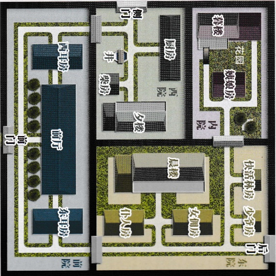
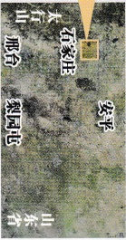

## 智乐源 豪门惊情系列剧本

←“正定”是县城，此时的“东兆通”、“西兆通”和“凌透”都是“石家庄”东面的村镇。

豪门惊情系列剧本《绝崖雕》

游戏设计 & 原创故事：刘斯宇 / 美术 & 原画：文博 / 美工：凤舞渊 兔淘淘

版权所有 北京智乐源文化发展有限公司 2020

↓“宝庄”院墙高2.5米，分为四个院，其中的晨楼、夕楼和暮楼都高约5米（每层高2.5米），楼距离院墙约2米，暮楼二层只能从露台进出。

北

女。二十三岁，性格内向，身穿花衣，鬓戴白花，住在内院『暮楼』一层。

## “夫人侄女”春娅

## 絕崖雕