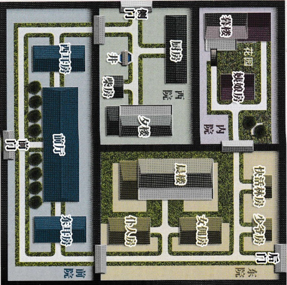

# 智乐源 豪门惊情系列剧本

←“正定”是县城，此时的“东兆通”、“西兆通”和“凌透”都是“石家庄”东面的村镇。

↓ “宝庄”院墙高2.5米，分为四个院，其中的晨楼、夕楼和暮楼都高约5米（每层高2.5米），楼距离院墙约2米，暮楼二层只能从露台进出。

豪门惊情系列剧本《绝崖雕》

游戏设计 & 原创故事：刘斯宇 / 美术 & 原画：文博 / 美工：风舞渊 兔淘淘

版权所有 北京智乐源文化发展有限公司 2020

女。十七岁，窄肩细腰，性格偏柔弱，和母亲一起住在内院『暮楼』二层。

## “夫人之女”莲儿

## 我找不到大哥了，他不会出事吧？

