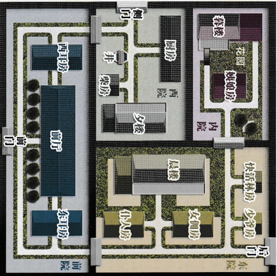

## 智乐源 豪门惊情系列剧本

←“正定”是县城，此时的“东兆通”、“西兆通”和“凌透”都是“石家庄”东面的村镇。

豪门惊情系列剧本《绝崖雕》

游戏设计 & 原创故事：刘斯宇 / 美术 & 原画：文博 / 美工：风舞渊 兔洵淘

版权所有 北京智乐源文化发展有限公司 2020

↓“宝庄”院墙高2.5米，分为四个院，其中的晨楼、夕楼和暮楼都高约5米（每层高2.5米），楼距离院墙约2米，暮楼二层只能从露台进出。

女。十六岁，性格倔强，和母亲一起住在内院「姨娘房」。

## “姨娘之女” 禾儿

虽然我和娘的出身比不了姐姐和夫

但也不能平白被人欺负！

## 绝崖雕