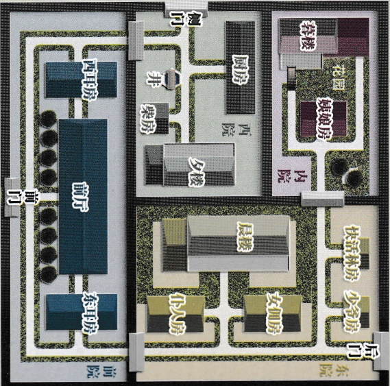
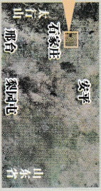

# 缺失

←“正定”是县城，此时的“东兆通”、“西兆通”和“凌透”都是“石家庄”东面的村镇。

振头站

宝

庄

■东北通

■西北通

↓“宝庄”院墙高2.5米，分为四个院，其中的晨楼、夕楼和暮楼都高约5米（每层高2.5米），楼距离院墙约2米，暮楼二层只能从露台进出。

缺失《绝崖雕》

游戏设计 & 原创故事：刘斯宇 / 美术 & 原画：文博 / 美工：风舞渊 兔淘淘 版权所有 北京缺失文化发展有限公司 2020

zhileyuanbg.cn

男。三十多岁，为人恭顺，住在东院，口快京腔，很瘦，快活林房。

# # 絕崖雕

## “戏曲艺人”快活林

我当年在京城住在皇城南面，见过