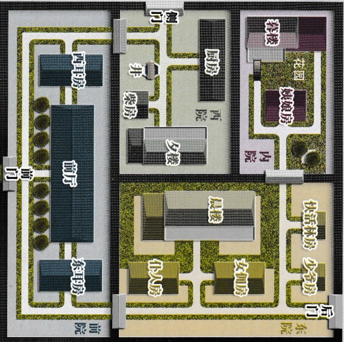

## 智乐源 豪门惊情系列剧本

←“正定”是县城，此时的“东兆通”、“西兆通”和“凌透”都是“石家庄”东面的村镇。

豪门惊情系列剧本《绝崖雕》

↓“宝庄”院墙高2.5米，分为四个院，其中的晨楼、夕楼和暮楼都高约5米（每层高2.5米），楼距离院墙约2米，暮楼二层只能从露台进出。

游戏设计 & 原创故事：刘斯宇 / 美术 & 原画：文博 / 美工：风舞渊 兔淘淘 版权所有 北京智乐源文化发展有限公司 2020

zhileyuanbg.cn

撑衣男。

不到三十岁，身穿粗布旧平时肩挎药箱，手持「虎住在西院夕楼」一层。

## “江湖郎中”石孙

## 有病早来治，不可多延迟……养病