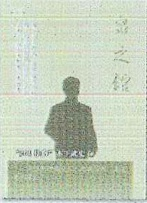
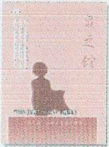
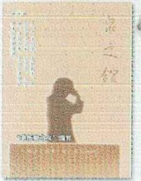
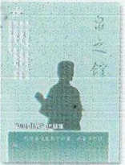
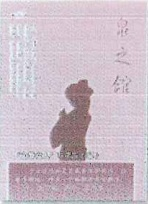
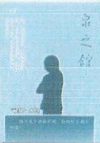
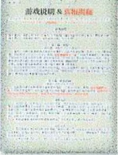
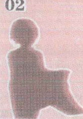
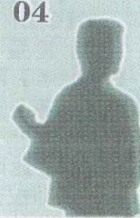
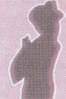

世上没有像模子刻出来一样的恶人。平时大家都是善人，至少大家都是普通人。然而正因为一到紧要关头就会突然变成恶人，所以才可怕，所以才不能大意。

夏目漱石

## 声明

《泉之馆》原创人物、故事，作者拥有全部版权

未经许可不能进行改编、出版、复制、销售、公开传播等行为

违者将视情况追究法律责任

本游戏为虚构故事，请勿与现实中的人物、团体和事件相联系

更不要模仿或试图模仿游戏里的内容

我们不承担由此引起的任何后果及责任

《泉之馆》是一个供18岁以上人士进行的角色扮演游戏

含有如谋杀、阴谋等内容，如果您对此持反对态度，请不要参与

## 尊敬的女士 / 先生：

当您看到这行字时，就代表您已经准备好开始参加一次“豪门惊情系列剧本”的角色扮演推理游戏。

我们的故事发生在距今一百多年前的1914年（民国三年）9月16日。

这场推理游戏包括一共两幕，时间大约在4个小时，请准备好水或一些饮料，可以自由活动。

开始游戏后，请大家认真扮演好自己的角色，找出案件的真相，以及真相背后的故事——除了可能发现的线索，情报还隐藏在玩家们的行为或语言之中。

最后，祝大家享受游戏乐趣。

——北京智乐源2021.5.3

## 游戏内容

①、六名角色的剧本——剧本背面有“地图”。

②、游戏说明 & 真相——在游戏结束后才能阅读“真相”

③、线索卡——“随身物品”+“泉之馆”内+“秘密线索”

游戏的玩家人数共计六人，都是剧本角色，不包括警察或侦探类的角色，也不包括主持人。警察或侦探还有主持人也可以根据实际情况自行添加。

游戏开始前，先把线索卡背面向上，分类摆好

## 你知道吗？

在几个小时以后，玩家们都充分了解了情况之后，大家也都没有要继续询问或者调查的内容之后，可以宣布游戏结束。

## 角色结局

这时玩家们要填写“你知道吗？”，包括指认凶手，完成任务，揭露秘密等。然后公开所有的内容。

在游戏结束之后，玩家们按自己的游戏效果（是否完成目标或者其他），阅读自己扮演角色的一个特定结局（每个角色都有不同结局，目的完成得越多，结局往往就会越好）。

注：有的目的会触发额外结局，可以把所有满足条件的结局都叠加，作为完整结局，例如同时满足“结局一”和“结局三”，就可以组合起来作为一个结局。

## 扮演角色

（注：角色的年龄皆是“虚岁”，以“出生年”为1岁）

## “201 住客” 木下武史

男。二十出头。身穿名为『诘襟』的立领制服，短发，头发上有水。说中文时有山东口音。02

## “202 住客”やよい（弥生）

女。二十出头。身穿名为『浴衣』的薄衣，画着艳妆，个子不高。说中文时有山东口音。

03

## “老板娘之女”瑞容

女。二十出头。身披雨衣，里面是中式衣裤，长头发，瓜子脸，皮肤白皙。平时负责登记客人的住宿情况。

04

## “204 住客” 伊藤宽

男。四十多岁。身穿名为『羽织』的外套，上绣代表『伊藤氏』的纹章。经常饮酒，说中文时有山东口音。

05

## “文静女人”いずみ（泉）

女。二十出头。身穿名为『海老茶』的二尺袖和服，头戴缎带，穿皮靴，面容因恐惧而扭曲。说中文时有山东口音。06

## “雇员”水伯

男。不到五十岁。面容苍老多皱，身穿皱巴巴的衣裤，脸和头发上有水，平时负责烧锅炉，有南方口音。

（先不要翻开下一页）

【警告】后面是事件的“全部真相”，请不要在游戏结束前打开观看