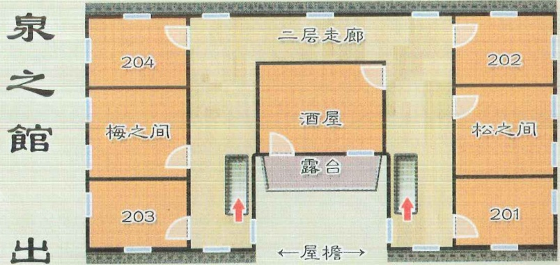
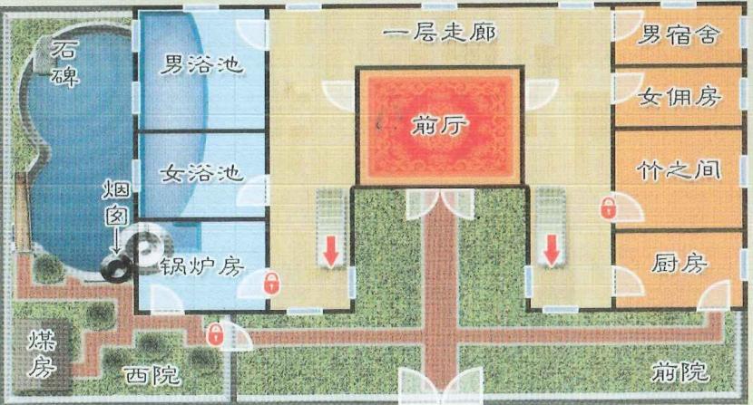

## 1 

# 智乐源 豪门惊情系列剧本

故事背景

1914年（民国三年）9月16日

早在1904年的济南开埠之前，就有日本人来济经商——之后随着“胶济铁路”和“津浦铁路”通车，济南成为南北交通枢纽，被日本视为移民侵略的重要据点之一。第一次世界大战爆发后，日本借口对德宣战，派军队到达龙口，入侵山东……

在济南城的南郊，有一处依泉而建旅舍——门口的匾额上写着“泉之馆”，落款只有一个“出”字，院内有高约5米的二层小楼——为了吸引住客，老板娘请人在一层安装烧水锅炉，将天然泉水引流加热，成为可以泡澡的人工温泉……

豪门惊情系列剧本《泉之馆》

豪门惊情系列剧本《泉之馆》

游戏设计 & 原创故事：刘斯宇 / 美术 & 原画：文博 / 美工：凤舞渊 兔淘淘

版权所有 北京智乐源文化发展有限公司 2021

zhileyuanbg.cn

男。二十出头。身穿名为『诘襟』的立领制服，短发，头发上有水。说中文时有山东口音。

“201 住客” 木下武史

没想到伊藤宽大人也在这里，真是失礼了！

