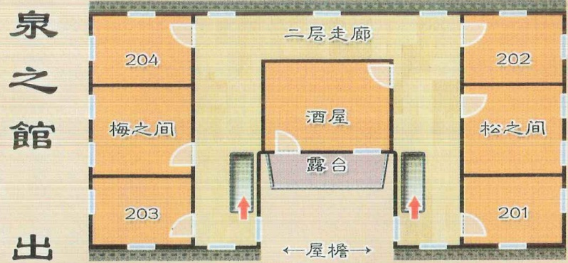
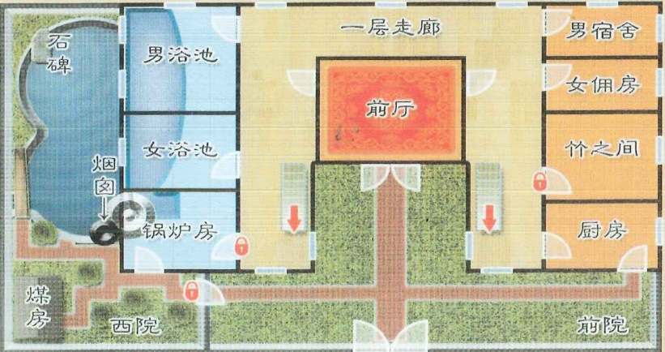

## 3 

# 智乐源 豪门惊情系列剧本

## 故事背景

1914年（民国三年）9月16日

早在1904年的济南开埠之前，就有日本人来济经商——之后随着“胶济铁路”和“津浦铁路”通车，济南成为南北交通枢纽，被日本视为移民侵略的重要据点之一。第一次世界大战爆发后，日本借口对德宣战，派军队到达龙口，入侵山东……

在济南城的南郊，有一处依泉而建旅舍——门口的匾额上写着“泉之馆”，落款只有一个“出”字，院内有高约5米的二层小楼——为了吸引住客，老板娘请人在一层安装烧水锅炉，将天然泉水引流加热，成为可以泡澡的人工温泉……

豪门惊情系列剧本《泉之馆》

游戏设计 & 原创故事：刘斯宇 / 美术 & 原画：文博 / 美工：风舞渊 兔淘淘

版权所有 北京智乐源文化发展有限公司 2021

zhileyuanbg.cn

女。二十出头。身披雨衣，里面是中式衣裤，长头发，瓜子脸，皮肤白皙。平时负责登记客人的住宿情况。

## 泉之馆

“老板娘之女”瑞容

娘去了哪里？有人看见她吗？