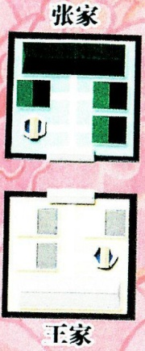
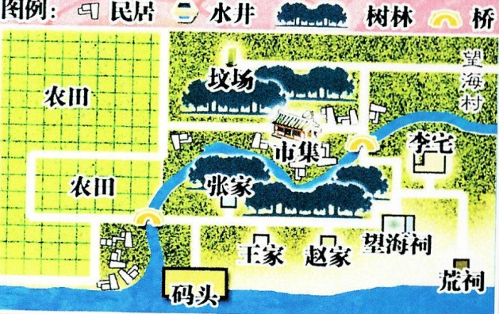
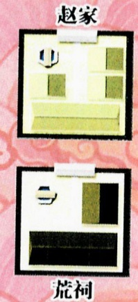
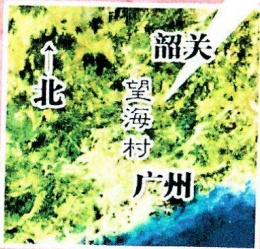
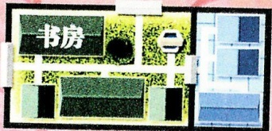
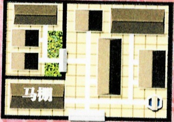

## 2 

## 智乐源 豪门惊情系列剧本

## 故事背景

1914年（民国三年）9月7日

在广东韶关西南，有一个“望海村”，村南的“望海祠”中，供奉着一尊“望海神”——“望海神”的来历早已无人知晓，几十年来，人们已经习惯用村名来称呼。

中元节后的第二天，“望海祠”的主人王渚寿被人发现死在祠中内院——当时院门从里锁上——等到破门之后，众人除了看到院内尚有余温的死者尸体，还看到地上有四个未干的血字……而这仅是随后一连串“自杀诅咒”的序幕！

望海祠

前院

李它前院

豪门惊惜系列剧本《望海祠》

游戏设计 & 原创故事：刘斯宁 / 美术 & 原画：云客 / 美工：灵兔 风舞渊

版权所有 北京智乐源文化发展有限公司 2021

zhileyuanbg.cn