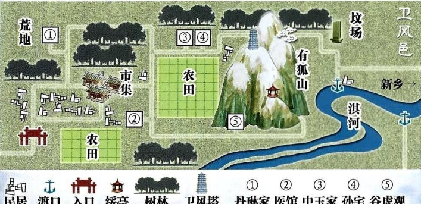
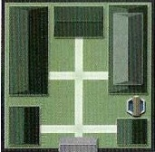
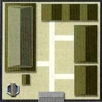
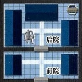

6

## 智乐源 豪门惊情系列剧本

狐五十岁，能变化为妇人。百岁为美女，为神巫，或为丈夫与女人交接，能知千里外事，善盅魅，使人迷惑失智。千岁即与天通，为天狐。

——（晋）郭璞《玄中记》

丹琳家

中玉家

孙宅

谷虎观

故事背景

1914年（民国三年）10月7日

自古以来，民间多有狐神、狐妖传说，被记载于各类传奇之中，北宋太平兴国年间，参知政事李昉等14人奉宋太宗之命整理古籍，从《朝野佥载》《广异记》等书中摘录到多达九卷的狐狸故事，皆有出处——虽然世间不乏以讹传讹之事，但“事出必有因”，如此之多的笔记，又岂能都是空穴来风？

在河南新乡之西，有一座较为封闭的“卫风邑”，邑内常见狐狸，东南还有一座“有狐山”，考其名称，竟是出自春秋时孔子编订《诗经》中的一篇《有狐》……

豪门惊情系列剧本《野狐悠谈》

游戏设计 & 原创故事：刘斯宇 / 美术 & 原画：文博 / 美工：风舞渊 兔淘淘

版权所有 北京智乐源文化发展有限公司 2020 zhileyuanbg.cn

# 野狐悠説

女。二十出头，身形瘦弱，长发散乱，面色苍白，身穿旧衣裙。

“谷虎门徒”井儿

师父让何师叔上山去采“淫羊藿”，

可能打算用它帮人治病。

