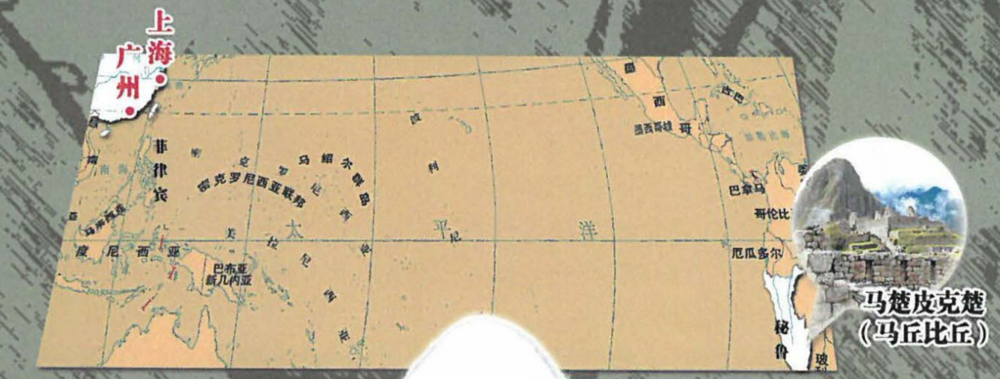
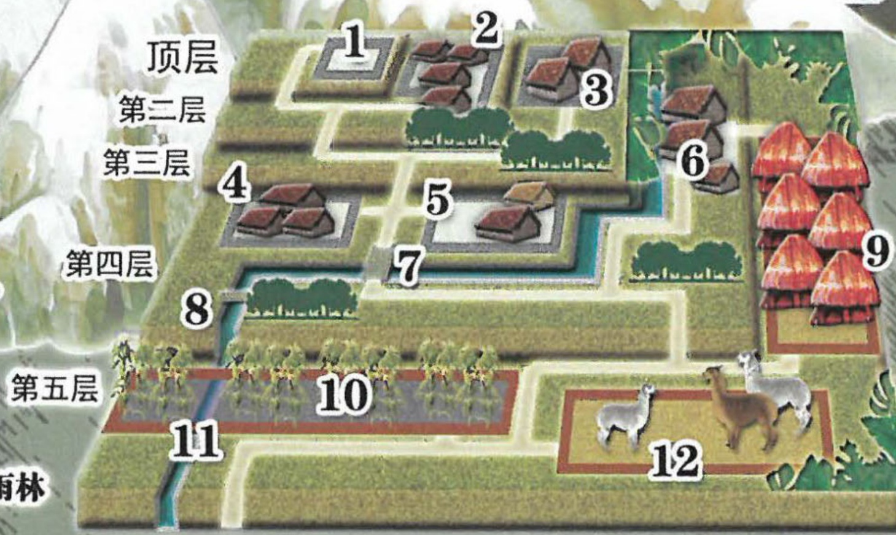

## 4 

## 智乐源 豪门惊情系列剧本

在约公元1200年，以“太阳神之子”自居的曼科·卡帕克率领部落来到位于今天南美洲秘鲁的库斯科，插下象征神权的金杖，创建被后人称作“印加帝国”的文明……初代“印加”曼科·卡帕克去世后，由他和姊妹兼王后的玛玛·奥克略·瓦科所生的长子继承王位，继续扩展王国版图，直到公元1492年，哥伦布到达美洲……

位于“梯田”最上方的五层

1、天象区。2、贵族区。

3、仓储区。4、神职区。

5、祭坛区。6、警备区。

7、石桥。8、下游石桥。

9、平民区。10、农田。

11、水渠。12、羊驼圈。

每层高3米左右。

1~5区都有围墙。第

树丛 雨林

豪门惊情系列剧本《仪式之门》

游戏设计 & 原创故事：刘斯宇 / 美术 & 原画：云客 / 美工：灵兔 风舞渊

版权所有 北京智乐源文化发展有限公司 2021

zhileyuanbg.cn

# 男。不到二十岁。短发，脸颊微肿，颈系围巾，穿着有补丁的粗布衣裤。

## “少年水手”洛迪

公主……我终于见到你了……