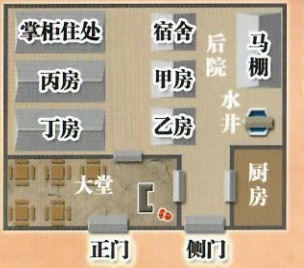

## 0

## 智乐源 豪门惊情系列剧本

福来客栈

章庄

豪门惊情系列剧本《章东镇迷案》

游戏设计 & 原创故事：刘斯宇 / 美术 & 原画：文博 / 美工：风舞渊 兔淘淘

版权所有 北京智乐源文化发展有限公司 2020

zhileyuanbg.cn

## 《章东镇迷案－游戏说明》&“真相揭秘”

请在游戏开始前阅读本说明，并按照流程进行游戏，“章庄”的内外地图在剧本背面

## 游戏流程

第1幕后，不调查，不可私聊（建议在此阶段多了解自己需要的信息）。

第2幕后，可以调查“章庄”内、外。

## 第1幕“寒暄”

（地点是“客栈大堂”，不调查）

首先，玩家们尽量挑选适合自己的角色；之后开始阅读自己剧本——从“背景故事”开始阅读（01页-06页，看到“先不要翻开下一页”时就不要再看），这样就能了解为什么你会出现在这里，并且知道你在“交流阶段”要注意表现什么样的“演技”，并尝试完成你的一部分目的（现在没有完成的“你的目的”可以在下个阶段继续完成）。注意：玩家在游戏里要通过自我介绍和发问来了解彼此。

然后玩家们扮演自己的角色开始游戏，可以互相聊天、询问，保持礼貌或作出相应的反应和表演——可以在这时尝试达成“你的目的”（本阶段是集体寒暄，没有私聊），并完成自己需要表现出来的内容。

第2幕“谁是真凶”

（调查之后可以私下交流）

玩家先阅读自己剧本有关这部分的内容（07页～08页，看到“先不要翻开下一页”时就不要再看）。此阶段玩家可以继续调查，直到拿完所有的线索卡（谁都没有可以拿的线索时，就结束调查）。

调查方法

# 调查时按“剧本编号”依次进行调查（满足条件后可以调查“秘密线索”）——每人只能隐藏最多1张回忆以外的线索卡（也可以不隐藏），拿到第2张后，必须决定公开1张或全部公开（没有可以拿的线索卡就跳过）。一轮搜证后可以交流，之后再继续调查——无论“章庄”内、外的线索，还是“秘密线索”，只能最多隐瞒1张——线索一旦被人拿取，其他人就不能再去拿了。

# 不能调查自己住的地方（例如蓝蕊不能调查后院“南楼”），没有自己可以拿的线索就跳过。

## “秘密线索”

# 有的线索卡（例如证人线索）上会标明通过指定“物品”（调查时获得）可以获得“秘密线索XX”，如果玩家持有指定“物品”，在下一轮调查时，就可以按标明的号码，拿取对应的一个“秘密线索”——“秘密线索”的号码写在线索卡背面。

# 如果“证人线索”已经公开，持有指定“物品”的人可以去拿对应的“秘密线索”；如果“物品”已经公开，持有指定“证人线索”的人可以去拿对应的“秘密线索”；如果该“物品”和该“证人线索”都已经公开，那任何人都可以去拿对应的“秘密线索”。

## “回忆”

当你听到或看到“关键词”（玩家的剧本06页上有每人都有自己的“关键词”以及对应的“回忆数字”，但是自己不能说出“关键词”，必须其他玩家提到，或线索上面写明）时，可以翻开（触发）“自己的回忆”里对应数字的“回忆片段”并阅读（“回忆”在翻开前背面向上放在面前）。例如：玩家顾楚梦的回忆有“夕婷——顾楚梦的回忆02”。玩家B说出“夕婷”，扮演顾楚梦的玩家就可以立刻翻开自己编号02的回忆并阅读（回忆的内容不能给其他人阅读，可以转述或编造）。