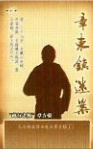
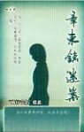
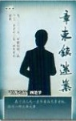
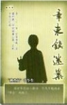
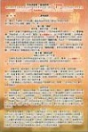
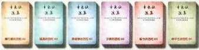

羞日遮罗袖，愁春懒起妆。易求无价宝，难得有心（情）郎。

——《赠邻女》鱼玄机

## 声明

《章东镇迷案》原创人物、故事，作者拥有全部版权

未经许可不能进行改编、出版、复制销售、公开传播等行为

违者将视情况追究法律责任

本游戏为虚构故事，请勿与现实中的人物、团体和事件相联系

更不要模仿或试图模仿游戏里的内容

我们不承担由此引起的任何后果及责任

《章东镇迷案》是一个供18岁以上人士进行的角色扮演游戏

含有如谋杀、阴谋等内容，如果您对此持反对态度，请不要参与

## 尊敬的女士/先生：

当您看到这行字时，就代表您已经准备好开始参加一次“豪门惊情系列剧本”的角色扮演推理游戏。

我们的故事发生在距今一百多年前的1914年（民国三年）9月25日。

这场推理游戏包括一共两幕，时间大约在4个小时，请准备好水或一些饮料，可以自由活动。

开始游戏后，请大家认真扮演好自己的角色，找出案件的真相，以及真相背后的故事——除了可能发现的线索，情报还隐藏在玩家们的行为或语言之中。

最后，祝大家享受游戏乐趣。

——北京智乐源2020.5.15

## 游戏内容

①、六名角色的剧本——剧本背面有“地图”。

②、游戏说明 & 真相——在游戏结束后才能阅读“真相”

③、线索卡——角色回忆+“章庄”内外+“秘密线索”

游戏的玩家人数共计六人，都是剧本角色，不包括警察或侦探类的角色，也不包括主持人。警察或侦探还有主持人也可以根据实际情况自行添加。

游戏开始前，先把线索卡背面向上，分类摆好

## 你知道吗？

在几个小时以后，玩家们都充分了解了情况之后，大家也都没有要继续询问或者调查的内容之后，可以宣布游戏结束。

这时玩家们要填写“你知道吗？”，包括指认凶手，完成任务，揭露秘密等。然后公开所有的内容。

## 角色结局

在游戏结束之后，玩家们按自己的游戏效果（是否完成目标或者其他），阅读自己扮演角色的一个特定结局（每个角色都有不同结局，目的完成得越多，结局往往就会越好）。

注：有的目的会触发额外结局，可以把所有满足条件的结局都叠加，作为完整结局，例如同时满足“结局一”和“结局三”，就可以组合起来作为一个结局。

## 扮演角色

（注：民国前出生的角色的年龄皆是“虚岁”，以“出生年”为1岁）

“商行老板”章方豪男。三十八岁。头戴六合帽，中等身高，手按钱袋，眉头紧锁，面上风尘仆仆。

02

“商行千金”蓝蕊

女。十七岁。娇美柔弱，

声音动听，处事谨慎，在校时成绩一般。

03

## “特派专员”顾楚梦

男。二十三岁。样貌俊朗，高个子，身穿中山装，神色有些凝重。04

## “专员之妻”夕婷

女、十八岁。梳着少妇的发型，柳眉秀目，五官端正却面带愠色。在校时的成绩较好。

05

“女学生”杨敏兮

女。十八岁。秀丽聪敏，

面容却十分憔悴，在校

时的成绩很好。

06

“稽查员”申午生

男。二十一岁。中等身高，衣着朴素。平时做事认真，在税务衙门任职。

（先不要翻开下一页）

【警告】后面是事件的“全部真相”，请不要在游戏结束前打开观看